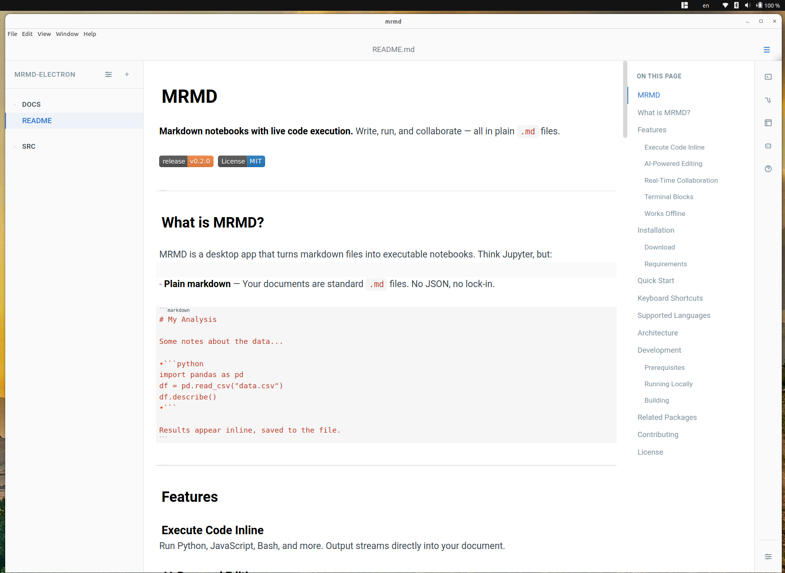

# MRMD

**Markdown notebooks with live code execution.** Write, run, and collaborate — all in plain `.md` files.

[](https://github.com/MaximeRivest/mrmd-electron/releases)<  [](LICENSE)>



---

## What is MRMD?

MRMD is a desktop app that turns markdown files into executable notebooks. Think Jupyter, but:

- **Plain markdown** — Your documents are standard `.md` files. No JSON, no lock-in.

```markdown
# My Analysis

Some notes about the data...

​```python
import pandas as pd
df = pd.read_csv("data.csv")
df.describe()
​```

Results appear inline, saved to the file.
```

---

## Features

### Execute Code Inline
Run Python, JavaScript, Bash, and more. Output streams directly into your document.

### AI-Powered Editing
Press `Ctrl+K` to edit with AI. Describe what you want, and the AI modifies your code or text.

### Real-Time Collaboration
Share your notebook URL. Changes sync instantly between all connected users.

### Terminal Blocks
Embed interactive terminals with ` ```term ` blocks. Full PTY support.

### Works Offline
Everything runs locally. Your code, your data, your machine.

---

## Installation

### Download

Get the latest release for your platform:

| Platform | Download |
|----------|----------|
| **Linux** | [AppImage](https://github.com/MaximeRivest/mrmd-electron/releases/latest/download/MRMD-0.2.0.AppImage) · [.deb](https://github.com/MaximeRivest/mrmd-electron/releases/latest/download/mrmd-electron_0.2.0_amd64.deb) |
| **macOS** | [Intel .dmg](https://github.com/MaximeRivest/mrmd-electron/releases/latest/download/MRMD-0.2.0.dmg) · [Apple Silicon .dmg](https://github.com/MaximeRivest/mrmd-electron/releases/latest/download/MRMD-0.2.0-arm64.dmg) |
| **Windows** | [Installer](https://github.com/MaximeRivest/mrmd-electron/releases/latest/download/MRMD.Setup.0.2.0.exe) · [Portable](https://github.com/MaximeRivest/mrmd-electron/releases/latest/download/MRMD.0.2.0.exe) |

### Requirements

- **Python 3.11+** with [uv](https://github.com/astral-sh/uv) package manager
- **Node.js 18+** (bundled in most cases)

MRMD automatically downloads required Python packages (`mrmd-python`, `mrmd-ai`, etc.) on first run.

---

## Quick Start

1. **Download and install** MRMD for your platform
2. **Open a folder** containing `.md` files (or create a new one)
3. **Write code blocks** using standard markdown fences:

   ````markdown
   ```python
   print("Hello, MRMD!")
   ```
   ````

4. **Run code** by clicking the play button or pressing `Ctrl+Enter`
5. **See results** appear inline, saved directly to your markdown file

---

## Keyboard Shortcuts

| Action | Shortcut |
|--------|----------|
| Run cell | `Ctrl+Enter` |
| Run cell and advance | `Shift+Enter` |
| AI edit | `Ctrl+K` |
| Search File or Create Files or Project | `Ctrl+P` |

---

## Supported Languages

| Language | Runtime | Status |
|----------|---------|--------|
| Python | `mrmd-python` | Full support |
| JavaScript | `mrmd-js` | Full support |
| Bash | `mrmd-bash` | Full support |
| Terminal | `mrmd-pty` | Interactive PTY |
| R | `mrmd-r` | Coming soon |
| Julia | `mrmd-julia` | Coming soon |

---

## Architecture

MRMD uses a modular architecture:

```
┌─────────────────────────────────────────────────────────┐
│                    MRMD Electron                        │
│  ┌─────────────┐  ┌─────────────┐  ┌─────────────┐     │
│  │ mrmd-editor │  │ mrmd-sync   │  │ mrmd-monitor│     │
│  │ (UI)        │  │ (sync)      │  │ (execution) │     │
│  └─────────────┘  └─────────────┘  └─────────────┘     │
└─────────────────────────────────────────────────────────┘
                          │
                          ▼
┌─────────────────────────────────────────────────────────┐
│                  Python Runtimes                        │
│  ┌─────────────┐  ┌─────────────┐  ┌─────────────┐     │
│  │ mrmd-python │  │ mrmd-bash   │  │ mrmd-ai     │     │
│  │ (code exec) │  │ (shell)     │  │ (AI assist) │     │
│  └─────────────┘  └─────────────┘  └─────────────┘     │
└─────────────────────────────────────────────────────────┘
```

- **mrmd-editor** — CodeMirror-based editor with markdown rendering
- **mrmd-sync** — Yjs CRDT server for real-time collaboration
- **mrmd-monitor** — Headless execution daemon (survives app restart)
- **mrmd-python** — Python runtime with streaming output
- **mrmd-bash** — Bash runtime for shell blocks
- **mrmd-ai** — AI programs for Ctrl+K editing and completions

---

## Development

### Prerequisites

```bash
# Install uv (Python package manager)
curl -LsSf https://astral.sh/uv/install.sh | sh

# Clone the monorepo
git clone https://github.com/MaximeRivest/mrmd-packages.git
cd mrmd-packages/mrmd-electron
```

### Running Locally

```bash
# Install dependencies
npm install

# Bundle sibling packages
npm run bundle

# Start in development mode
npm start
```

### Building

```bash
# Build for current platform
npm run build

# Build for specific platform
npm run build:linux
npm run build:mac
npm run build:win
```

---

## Related Packages

| Package | Description | Registry |
|---------|-------------|----------|
| [mrmd-editor](https://github.com/MaximeRivest/mrmd-editor) | CodeMirror editor component | npm |
| [mrmd-python](https://github.com/MaximeRivest/mrmd-python) | Python execution runtime | PyPI |
| [mrmd-ai](https://github.com/MaximeRivest/mrmd-ai) | AI editing programs | PyPI |
| [mrmd-bash](https://github.com/MaximeRivest/mrmd-bash) | Bash execution runtime | PyPI |
| [mrmd-sync](https://github.com/MaximeRivest/mrmd-sync) | Yjs sync server | npm |

---

## Contributing

Contributions are welcome! Please read our contributing guidelines before submitting PRs.

1. Fork the repository
2. Create a feature branch (`git checkout -b feature/amazing-feature`)
3. Commit your changes (`git commit -m 'Add amazing feature'`)
4. Push to the branch (`git push origin feature/amazing-feature`)
5. Open a Pull Request

---

## License

MIT License. See [LICENSE](LICENSE) for details.

---

<p align="center">
  <b>MRMD</b> — Markdown that runs.
</p>
